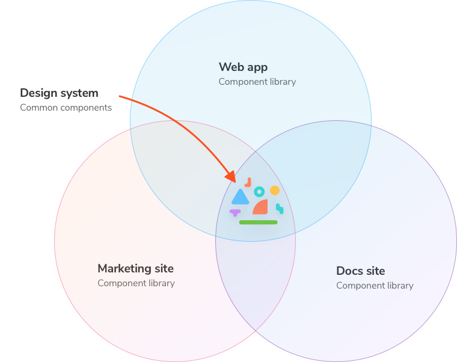

# 📚 Storybook

- **Component-first development**
  - Not all your team members need deep React knowledge
- Living documentation
- Visually test components




## Add Storybook

[Get started](https://www.learnstorybook.com/intro-to-storybook/react/en/get-started/)

```shell
npx -p @storybook/cli sb init

yarn storybook
```
