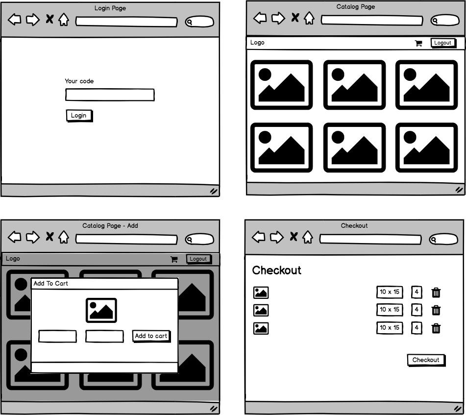
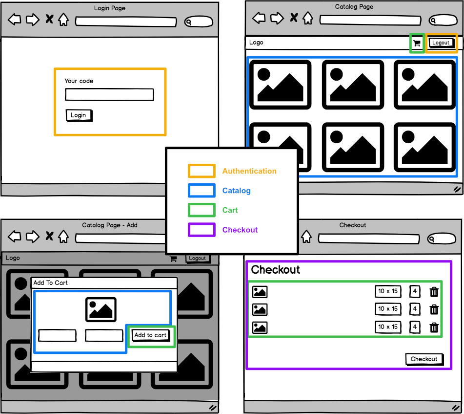
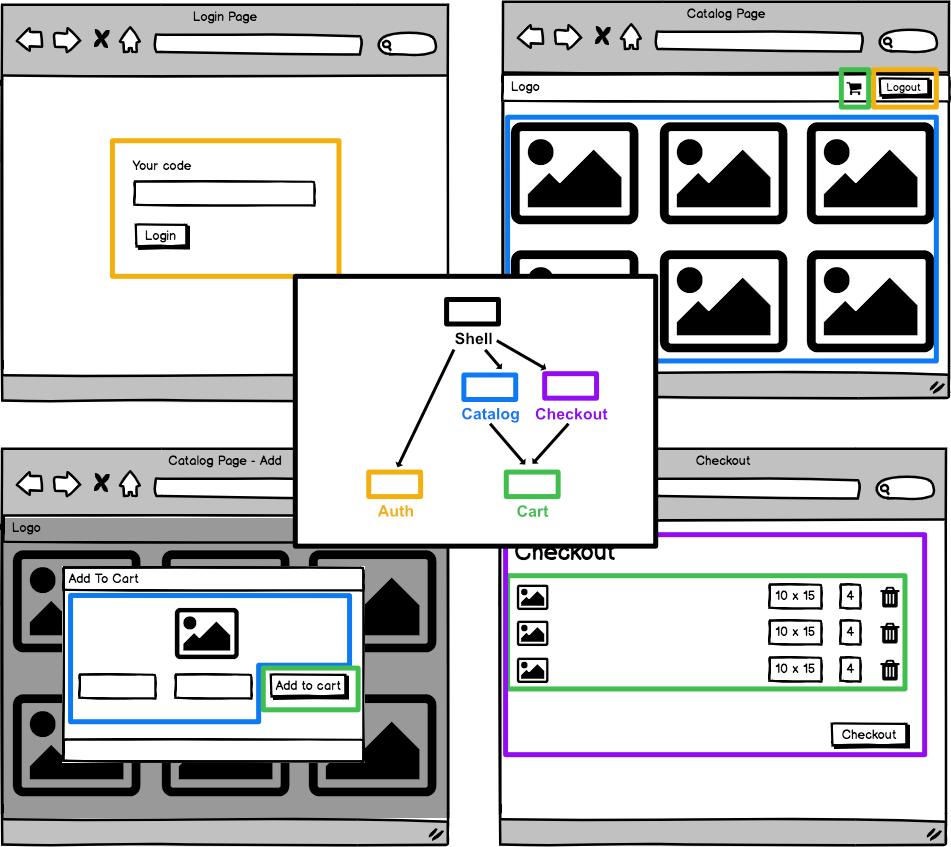

# 📦 Architecture

## Where is the complexity?

_(In a typical, centralized, business application)_

The real complexity of front-end development is maintaining a consistent **architecture** based on the decisions of the **tech stack**.
Early architectural decisions have a profound impact on the quality and ease of development for the remainder of the project's lifespan.

We need a **scalable** and **adaptable** architecture to accommodate changes of requirements and scope.

## Scalable architecture

What can we learn from the concepts and patterns used in the back-end (e.g. DDD)?
What can we apply in the front-end?

- Start with naming things correctly => ubiquitous language (= use terminology the domain expert uses. )
- We can organize code based on the subdomains of our application.
  -> Separation of Concerns by functionality, rather than by technology




## Which modules can access which modules



Minimizing dependencies between individual libraries help maintainability.

If there were no limits, we would have a heap of intermingled libraries where each change would affect all the other libraries.

But, setting hard boundaries between dependencies in JavaScript is difficult without good tooling.

## Nx

Nrwl's **Nx** helps to breakdown a solution into different applications and libraries.
It provides a set of dev tools to manage dependencies between our libraries.

Each library has a public API exposed via a generated index.ts (= barrel file)
=> The internals of a library can be changed without affecting other libraries

We define following categories for libraries:

- **feature**: Implements a use case
- **ui**: Use case agnostic, reusable, components
- **data-access**: Data access (HTTP, WebSockets)
- **util**: Helper functions
- **shell**: Entry point for an app

### Getting started

```shell
# Create new workspace
npx create-nx-workspace@latest

# See dependency graph
yarn dep-graph

# Lint
yarn lint

# Prettier
yarn format:check
yarn format:write

# Add lib
yarn nx g @nrwl/react:lib shell --directory=photo-print --pascalCaseFiles --tags='scope:photo-print, type:shell'
```

### Nx tag configuration

.eslintrc

```json
"rules": {
    "@nrwl/nx/enforce-module-boundaries": [
      "error",
      {
        "enforceBuildableLibDependency": true,
        "allow": [],
        "depConstraints": [
          { "sourceTag": "scope:app", "onlyDependOnLibsWithTags": ["type:shell"] },
          { "sourceTag": "scope:shared", "onlyDependOnLibsWithTags": ["scope:shared"] },
          { "sourceTag": "type:shell", "onlyDependOnLibsWithTags": ["type:feature", "type:util"] },
          { "sourceTag": "type:feature", "onlyDependOnLibsWithTags": ["type:data-access", "type:util", "type:ui"] },
          { "sourceTag": "type:util", "onlyDependOnLibsWithTags": ["type:util"] }
        ]
      }
    ]
  }
```

## Alternative

Visualize / validate dependencies with [dependency cruiser](https://www.npmjs.com/package/dependency-cruiser), this can be integrated in any project.
